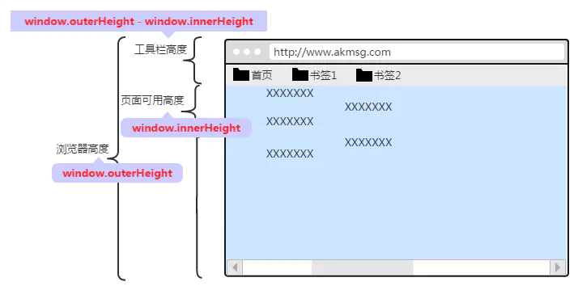

### 一. window 视图位置属性

1.1、window 对象获取视口（浏览器窗口）宽高

```js
console.log(window.innerHeight); // 939
console.log(window.innerWidth); // 809
console.log(window.outerHeight); // 1050 (包括菜单栏)
console.log(window.outerWidth); // 1680
```




1.2 属性解释

| 属性名             | 描述                                               |
| ------------------ | -------------------------------------------------- |
| window.innerHeight | 浏览器窗口可视区域高度                             |
| window.innerWidth  | 浏览器窗口可视区域宽度                             |
| window.outerHeight | 浏览器窗口整个高度，包括窗口标题、工具栏、状态栏等 |
| window.outerWidth  | 浏览器窗口整个宽度，包括侧边栏和调正窗口大小的边框 |

1.3 以下方式效果一样都是获取浏览器视口高度

```js
let width =
  window.innerWidth ||
  document.documentElement.clientWidth ||
  document.body.clientWidth;
let height =
  window.innerHeight ||
  document.documentElement.clientHeight ||
  document.body.clientHeight;
```


1.4 `document.documentElement.clientHeight` 和 `document.body.clientHeight` 的区别：

- `document.documentElement.clientHeight`：不包括整个文档的滚动条，但包括`<html>`元素的边框。
- `document.body.clientHeight`：不包括整个文档的滚动条，也不包括`<html>`元素的边框，也不包括`<body>`的边框和滚动条。

  1.5 window 对象获取浏览器窗口在显示器中的位置


- window.screenX 浏览器窗口在显示器中的水平位置
- window.screenY 浏览器窗口在显示器中的垂直位置
- window.screenLeft 浏览器可用空间左边距离屏幕（系统桌面）左边界的距离
- window.screenTop 浏览器窗口在屏幕上的可占用空间上边距离屏幕上边界的距离

### 二、元素视图位置属性

2.1 关于元素大小位置等信息的一些属性有三个家族:

- client 家族：clientLeft、clientTop、clientWidth、clientHeight、height、width
- offset 家族：offsetLeft、offsetTop 、offsetWidth、offsetHeight、 offsetParent
- scroll 家族：scrollLeft、scrollTop、scrollWidth 、 scrollHeight

  2.2. client 家族介绍


clientWidth : 显示内容区域的宽度
clientHeight : 显示内容区域的高度

2.3、offset 家族介绍


offsetLeft : 相对于父级非 static 定位元素的左偏距离

offsetTop : 相对于父级非 static 定位元素的上偏距离

offsetWidth ：整个元素的宽度（包括边框）

offsetHeight ：整个元素的高度（包括边框）

offsetParent ： 第一个祖定位元素

2.4 scroll 家族介绍


document.documentElement.scrollTop 上边滚动高度

document.documentElement.scrollLeft 左侧滚动宽度

document.documentElement.scrollWidth 网页内容整体的宽度

document.documentElement.scrollHeight 网页内容整体的高度
