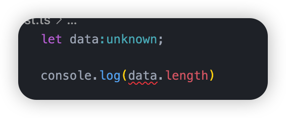

### 一.unknown和any的区别

``` ts {3}
let data:any;

console.log(data.length) // ts不会报错
```

当我们把`data`的类型改成`unknown`的时候就会报错



:::caution

一个变量为any类型，那么可以对这个变量进行任何操作

一个变量为unknown类型，那么不可以对这个变量进行任何操作，必须进行类型缩小之后才能进行操作

:::

``` ts {3-5}
let data:unknown;

if(typeof data === "string") {
  console.log(data.length)
}

```

### 二. never类型的使用


``` ts

// 当我们使用switch case的时候最好是在default的位置添加一个never类型的变量，防止有某种情况没有处理

function handleMessage(message: string | number | boolean) {
  switch (typeof message) {
    case "string":
      console.log(message.length)
      break
    case "number":
      console.log(message)
      break
    // case "boolean":
    //   console.log(Number(message))
      // break
    default:
      const check: never = message
  }
}

handleMessage("aaaa")
handleMessage(1234)

handleMessage(true)

```
上面的代码没有处理`boolean`类型，就会像下面一样报错.


### 三.函数上添加属性

假如我们想往函数上添加属性，比如下面的例子

``` ts
const foo = (num1:number,num2:number) => {
  return num1 + num2
};


foo.name = "haha"
foo.age = 18
```

假如我们想要给`foo`变量添加一个显示的类型就需要使用调用签名,下面两种方式都可以

``` ts
type fooType = {
  name:string
  age?:number
  (num1:number,num2:number):number
}

interface IFoo {
  name:string
  age?:number
  (num1:number,num2:number):number
}

```

### 四. 构造签名

下面的例子是我们给createPerson函数传递一个构造函数，在内部创建实例并返回

``` ts {5-7}
class Person {

}

interface IPerson {
  new (): Person
}

function createPerson(fn:IPerson) {
  const p = new fn();

  return p
}

console.log(createPerson(Person))
```

### 五. this的明确类型

``` ts {9}
type fooThisType = {
  name: string
}

type fooParamsType = {
  name: string
}

function foo(this: fooThisType, info: fooParamsType) {
  console.log(this.name);
}

```

### 六. 函数重载

函数重载最上方写具体的带类型的函数，但是没有对应的实现。 在最下方写一个不带类型的函数，但是实现它具体的逻辑

``` ts
function add(arg1: number, arg2: number): number;
function add(arg1: string, arg2: string): string;

function add(arg1: any, arg2: any) {
  return arg1 + arg2;
}

add(1,2)
add('hello','world');

```

### 七. 泛型参数的约束

``` ts
function getKey<T,U extends keyof T>(obj:T, key:U) {
  return obj[key];
}

const p = {
  name: "why",
  age: 18,
};

const data = getKey(p, "age");

```

### 八. 映射类型

``` ts
type MapType<T> = {
  [K in keyof T]: T[K];
};

interface IPerson {
  name: string;
  age: number;
}

const p: MapType<IPerson> = {
  name: "coder",
  age: 18,
};

```

映射类型也可以添加修饰符

``` ts
// 所有值只读
type MapType<T> = {
  readonly [K in keyof T]: T[K];
};

// 所有值可选
type MapType<T> = {
  [K in keyof T]?: T[K];
};

// 去掉所有值的可选属性
type MapType<T> = {
  [K in keyof T]-?: T[K];
};

// 去掉所有值的只读属性
type MapType<T> = {
  -readonly[K in keyof T]: T[K];
};

```
### 九. `Parameters<FuncType>`

获取一个函数签名的参数的类型

``` ts
type fooFuncType = (arg1:number,arg2:string) => number

type funcParamsType = Parameters<fooFuncType> // [arg1:number,arg2:string]

// 如果是一个函数可以使用typeof获取他的类型

const foo = (num1:number,num2:number) => {
  return num1 + num2
}

type fooType = Parameters<typeof foo> // [num1:number,num2:number]
```


